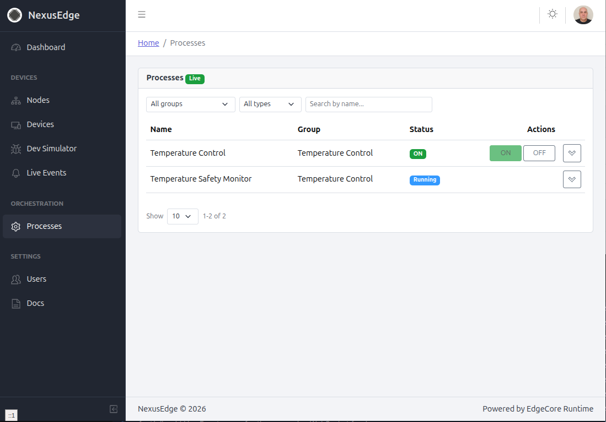
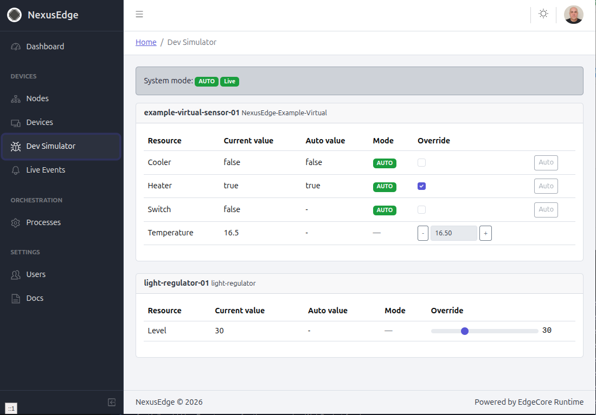

# NexusEdge — Open Edge Automation Platform

*Powered by EdgeCore Runtime.*

An edge-first, modular automation platform for controlling physical (and
simulated) hardware — heating, lighting, aquarium equipment, industrial
nodes, and anything else that speaks a bus protocol. The platform itself is
not an application: it's the reusable core (device registry, real-time
messaging, orchestration, admin UI) that domain-specific systems get built
on top of. The first such system, a Smart House controller, lives in its
own separate repository.

Everything here is designed to run unattended on constrained hardware
(Raspberry Pi class), fully containerized, with no cloud dependency for
local operation.

## Screenshots

| Processes / Orchestration | Dev Simulator |
|---|---|
|  |  |

The **Processes** page runs a real 1-second control loop (a temperature
controller driving a virtual heater/cooler pair) with a live, independent
safety monitor watching the same device. The **Dev Simulator** lets you
drive every virtual device's sensors by hand — no physical hardware
required to develop or demo against.

## What's actually built

This is a working vertical slice, not a scaffold — every item below runs
end-to-end today, verified live in a running container stack (see
`to-do.txt` for the full, dated build log):

- **EdgeX Foundry integration** (Palau 4.0.2) with a **custom Go
  device-service** (`apps/device-service`) written against the EdgeX
  Device SDK — no official EdgeX service supports CAN bus, so this was
  built from scratch, with a `PhysicalTransport` interface so the next bus
  (RS485, Modbus, MQTT...) is a new package, not a rewrite.
- **Dual Devices Model** — every device resource is independently
  `AUTO` (orchestrator-driven) or `MANUAL` (UI override), with a
  **Model State Validator** that rejects physically forbidden combined
  states (e.g. heating and cooling the same zone at once) before they ever
  reach the hardware.
- **Virtual Node Runtime** — physical vs. virtual is a per-device
  config flag handled inside the same device-service process, so
  developing and testing new device types never requires real hardware.
- **Event-driven messaging** — a RabbitMQ topic exchange plus a
  dedicated WebSocket gateway (`apps/messaging-gateway`) push every state
  change to the UI in real time, filtered per-client by routing-key
  pattern.
- **Orchestrator with real control logic** (`apps/orchestrator`) — a
  1-second tick loop, demonstrated with a temperature controller and an
  independent safety monitor that flags critical states across the whole
  UI.
- **UI authentication** — JWT in an httpOnly/`SameSite=Strict` cookie,
  bcrypt-hashed passwords, Postgres-backed users with roles stored as a
  proper set (not a comma-joined string), protected `admin`/`system`
  accounts, and avatar upload.
- **A universal pagination/filtering toolkit** for admin tables (debounced
  search, page-size control, client-side pagination) — built once, reused
  across every list view in the app.
- **One real device type end-to-end** (`devices/standalone/light-regulator`)
  — contract schema, EdgeX device profile, safety rules, and both a
  production and a dev-simulator UI component, following the same
  convention every future device type will use.

Deliberately **not** done yet, and documented as such rather than left
quiet: per-endpoint API authorization (today only the UI login and the
`/users` admin endpoints are gated — device/process control endpoints are
still open), real CAN hardware has not been tested against the transport
code, and there's no heartbeat/liveness signal from devices yet.

## Architecture

```
Physical Device -> Node -> Bus Transport (CAN first)   --\
                                                            >-- device-service --> EdgeX --> Devices API --> Orchestrator <-> UI
Virtual Device  -> Virtual Node -> Virtual Node Runtime --/
```

The Devices API also pushes every state change onto a RabbitMQ event bus;
`apps/messaging-gateway` fans it out to the UI over WebSocket, so the
browser never polls. The UI reaches the Devices API directly for
per-device control and the Orchestrator directly for starting/stopping
automation processes — two separate concerns, two separate channels.

## Tech stack

| Layer | Choice |
|---|---|
| Runtime | Node.js 22, TypeScript, pnpm workspaces + Turborepo |
| Backend HTTP | Fastify, Pino logging |
| Storage | PostgreSQL 16 (device/process registry), Redis 7 (live state + Dual Devices Model) |
| Messaging | RabbitMQ 4 (`nexus.events` topic exchange), `@fastify/websocket` |
| Hardware hub | EdgeX Foundry Palau 4.0.2, no-security profile |
| Device driver | Go, EdgeX Device SDK |
| UI | React + Vite, CoreUI Free Admin Template |

## Repository layout

```
apps/           orchestrator, api, messaging-gateway, ui, device-service — the deployable platform services
packages/       shared libraries (empty for now)
plugins/        protocol/device-driver/UI/storage/AI plugins (empty for now)
devices/        device/node type definitions for physical & virtual devices,
                see AGENTS.md section 7 (light-regulator is the first real one)
examples/       example configurations (empty for now)
docs/           architecture vision (PROJECT_MASTER-1.1.md) and screenshots
```

## Requirements

- Docker + Docker Compose v2
- Node.js 22 is pinned for the workspace (`.nvmrc`), but all builds and
  services run inside containers — a local Node/pnpm install is not
  required.

## Quick start

```
cp .env.example .env
make up-all
```

This starts the platform services (PostgreSQL, Redis, RabbitMQ,
orchestrator, api, messaging-gateway, ui) together with the EdgeX Foundry
core stack and its custom device-service. Default login is `admin` /
whatever you set `ADMIN_DEFAULT_PASSWORD` to in `.env` — change it before
running this anywhere reachable.

See `Makefile` for all available targets and `AGENTS.md` section 16 for
details.

## Project status & docs

This is an actively developed platform, not a finished product. The
project is steered and logged step-by-step in `to-do.txt` (every
implementation decision, live-tested and dated); `AGENTS.md` is the living
technical reference (rules, architecture, per-feature design notes); and
`docs/PROJECT_MASTER-1.1.md` is the original architecture/vision document.
Read in that order for, respectively: *what happened and why*, *how it
works*, and *where it's going*.

## License

Apache License 2.0 — see `LICENSE`. `apps/ui` is based on the CoreUI Free
React Admin Template (MIT) — see `apps/ui/THIRD-PARTY-LICENSE-CoreUI.txt`.
